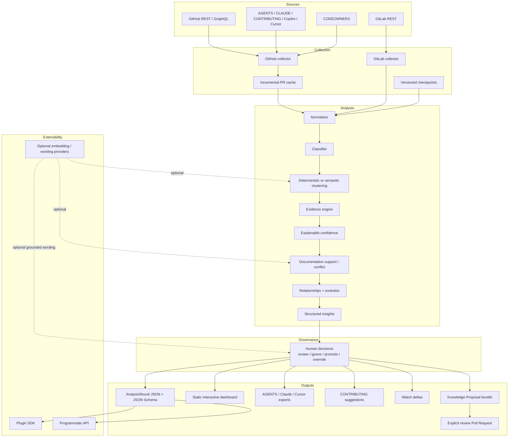
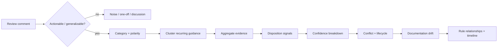

# ReviewDNA Architecture

ReviewDNA is an engineering-knowledge mining pipeline, not an AI policy generator. Its architecture keeps **collection, inference, evidence, governance, and publication** separate so every rule stays traceable and every repository write stays explicit.

## System view

## Design principles

1. **Evidence first.** A rule without traceable review evidence is not a ReviewDNA rule.
2. **Local first.** Core deterministic analysis works without a hosted service or AI account.
3. **Provider neutral.** Semantic/LLM stages are optional and isolated behind explicit interfaces.
4. **Human authority.** Historical inference and model-assisted wording never become policy until humans decide.
5. **Untrusted input.** Repository content can contain prompt injection, malformed text, HTML, or secrets.
6. **Machine readable.** `reviewdna.json` and the public `AnalysisResult` JSON Schema are first-class product surfaces.
7. **Auditable transformation.** Overrides preserve original inferred wording, evidence, confidence, and provenance.
8. **Review before mutation.** Generated policy is packaged first; GitHub writes require an explicit `--apply` step.
9. **Compatibility is tested.** Schema ABI, fingerprints, E2E behavior, and release metadata are regression-gated.
10. **No people ranking.** Reviewer signals improve evidence quality; they are not converted into employee scores.

## Collection boundary

### GitHub

The GitHub collector supports pagination, authentication, incremental PR caching, resolved review-thread state, optional deep commit→head evidence, explicit author-response signals, repository documentation, and CODEOWNERS.

### GitLab

The GitLab collector prototype normalizes merged Merge Request discussions/notes into the same `ReviewRecord` contract and supports configurable self-hosted GitLab base URLs. GitLab deep-evidence parity is intentionally not claimed yet.

### Cache and checkpoints

Raw review cache lives under `.reviewdna/` and is gitignored. Resumable checkpoints are accepted only when repository, input-content, and option hashes still match. Redaction modes disable raw caches/checkpoints when retaining sensitive source text would violate the user's privacy intent.

## Evidence pipeline

Evidence can be classified as `accepted`, `adopted`, `acknowledged`, `unresolved`, or `rejected-candidate`. A resolved thread is deliberately weaker than explicit adoption. `--deep-evidence` can strengthen a resolved inline review when the reviewed commit and merged head show a later change to the same file; this is treated as correlation, not causal proof.

Direct CODEOWNER review can increase evidence strength when the reviewer is a direct owner of the matched path. ReviewDNA does not guess team membership and does not rank individuals.

## Confidence model

Confidence is explainable rather than model-owned. Current scoring combines signals such as:

- recurrence/frequency;
- reviewer diversity;
- recency and persistence;
- accepted/adopted/acknowledged evidence;
- direct CODEOWNER evidence;
- rejected-candidate penalties;
- conflicts and lifecycle state.

The current weights are pre-v1 heuristics. Real-world labeled calibration remains a release requirement before ReviewDNA claims a stable v1 confidence contract.

## Semantic intelligence boundary

Semantic clustering and documentation matching are optional. Embeddings may help determine **which pieces of evidence belong together**, but they do not create evidence or approve a rule.

Optional wording providers may rewrite the wording of an already-discovered rule only after grounding checks. They cannot change confidence, evidence provenance, lifecycle, or human decisions.

## Documentation drift

ReviewDNA checks discovered conventions against common repository guidance and records each documentation match with:

- source path;
- `support` or `conflict`;
- matcher type (`lexical` or `semantic`);
- similarity score where applicable.

A polarity guard prevents semantic similarity alone from turning opposite instructions such as “Use X” and “Never use X” into compatible documentation.

## Rule identity and evolution

Presentation IDs such as `RULE-0001` may change between runs. ReviewDNA therefore uses content-derived fingerprints (for example `rdna-testing-...`) for decisions and snapshot matching.

Rules may carry relationships such as parent/child, `supersedes`, and `supersededBy`. Timeline events preserve first-seen, recurrence, documentation, lifecycle, and relationship evolution instead of deleting old conventions from history.

Fingerprints are tested for pre-v1 stability but are not yet declared a permanent v1 compatibility promise.

## Human decision layer

`reviewdna.decisions.json` supports:

- `review` — neutral;
- `ignore` — keep evidence visible but exclude from policy exports;
- `promote` — explicitly approve for policy exports;
- `override` — use maintainer-authored wording while retaining the original inference.

Human decisions do not rewrite evidence, reviewer counts, dates, or confidence.

## Knowledge Proposal boundary

The `proposal` command converts an already-reviewed `AnalysisResult` into a self-contained bundle with exact fingerprints, scopes, policy-selection outcomes, confidence values, and evidence URLs.

`publish-proposal` is dry-run by default. With explicit `--apply`, the GitHub publisher:

- accepts only `reviewdna/*` branches;
- writes only under `.reviewdna/proposals/<id>/`;
- creates a review Pull Request;
- never silently overwrites `AGENTS.md`, `CONTRIBUTING.md`, or other policy files.

This keeps **mining** and **repository mutation** as separate trust boundaries.

## Public contracts

ReviewDNA exposes several integration contracts:

- TypeScript workspace packages;
- Draft 2020-12 `AnalysisResult` JSON Schema;
- `@reviewdna/plugin-sdk` API version `1`;
- Collector/Provider/Exporter/Scorer plugin contracts;
- static report renderer;
- GitHub composite Action;
- CLI outputs and migration guidance.

The schema ABI and fingerprint behavior are covered by compatibility tests. Broader CLI/API stability becomes a formal promise only at v1.0.

## Security model

The security posture is intentionally defense-in-depth:

- repository/review content is treated as untrusted data;
- report HTML/SVG escapes review-derived content;
- prompt-injection-like provider output is rejected when detected;
- secrets/PII can be selectively redacted;
- remote providers are explicit opt-in;
- policy publishing is explicit and path-restricted;
- CodeQL and deterministic fuzz/security tests run in CI;
- Windows/macOS/Linux E2E protects cross-platform behavior.

See [SECURITY.md](SECURITY.md) and [docs/SECURITY_AUDIT.md](docs/SECURITY_AUDIT.md).

## Quality and release gates

The current CI matrix covers Node.js 20/22/24, schema compatibility, unit/regression tests, semantic/classification benchmarks, a reproducible 10k-review synthetic benchmark, docs verification, Docker, immutable released-Action smoke testing, Windows/macOS/Linux CLI E2E, and CodeQL.

These gates protect engineering behavior; synthetic benchmarks are not presented as real-world accuracy claims.
