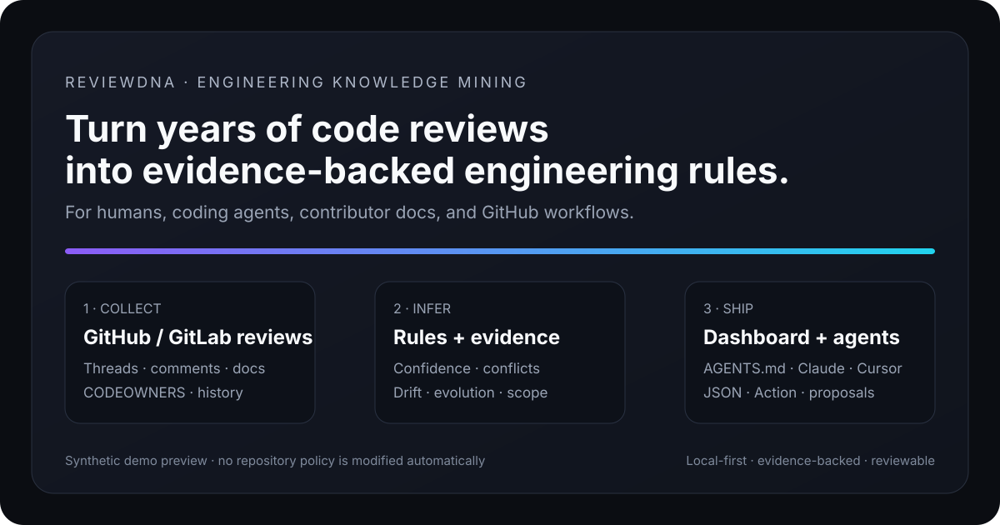
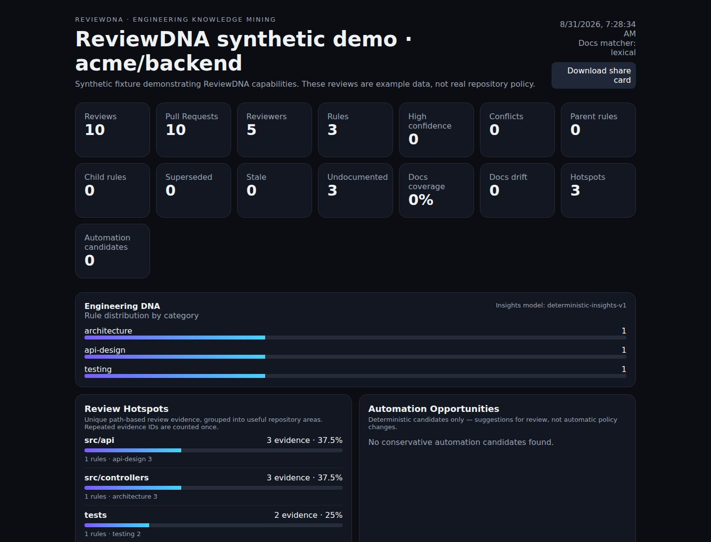
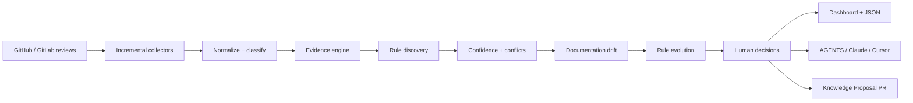
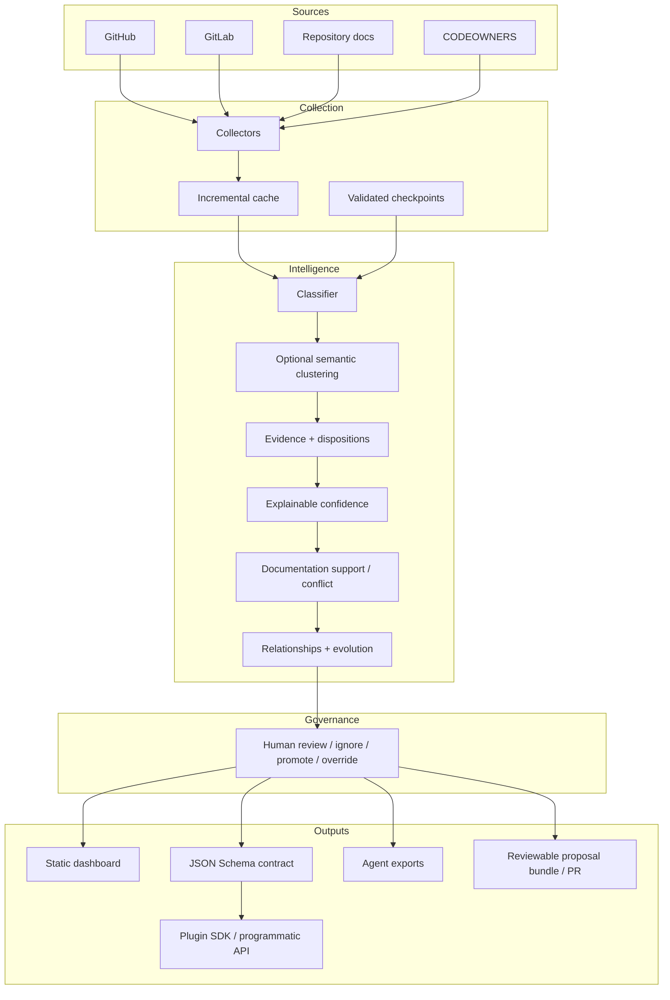

<div align="center">

# ReviewDNA 🧬

### Turn years of code reviews into evidence-backed engineering rules.

**Mine the standards your team actually enforces — then make them usable by humans, coding agents, contributor docs, and GitHub workflows.**

[](https://github.com/ahmed2qaid/reviewdna/actions/workflows/ci.yml)
[](https://github.com/ahmed2qaid/reviewdna/actions/workflows/codeql.yml)
[](https://github.com/ahmed2qaid/reviewdna/releases)
[](LICENSE)
[](package.json)
[](tsconfig.json)

[Quick start](#quick-start) · [Demo](#see-it-in-60-seconds) · [Architecture](#architecture) · [Docs](docs/) · [Roadmap](ROADMAP.md) · [Contributing](CONTRIBUTING.md)

</div>



---

## Why ReviewDNA?

Engineering standards rarely live in one place. They are scattered across hundreds or thousands of Pull Request comments:

- “Move database access out of controllers.”
- “Every behavior change needs a regression test.”
- “Do not log access tokens.”
- “Use the repository layer for persistence.”

Those decisions disappear into closed PRs. ReviewDNA turns them into a **traceable engineering knowledge layer**.

Every discovered convention keeps its evidence, confidence breakdown, reviewers, scope, history, documentation status, conflicts, and human decisions. ReviewDNA never treats generated rules as policy automatically.

> **History + evidence + recurrence + scope + confidence + drift + evolution + human review.**

## See it in 60 seconds

```bash
git clone https://github.com/ahmed2qaid/reviewdna.git
cd reviewdna
npm install
npm run build
node apps/cli/dist/index.js analyze-fixture fixtures/reviews.json --out demo-output
```

Open:

```text
demo-output/reviewdna-report.html
```

The fixture is synthetic and exists only to demonstrate the product safely. A real repository analysis uses the same engine.

### Real dashboard preview



> Real screenshot generated from the reproducible ReviewDNA public-demo artifact. The underlying reviews are synthetic example data, not real repository policy.

### Example result

```text
Repository: owner/repository

Analyzed
  Pull requests        842
  Review comments    4,128
  Reviewers             37

Engineering knowledge
  Recurring rules       42
  Undocumented          13
  Documentation drift    4
  Automation candidates  7
```

A discovered rule looks like this:

```text
Avoid direct database access from controllers.

Confidence: 93%
Status: Established
Scope: backend/**
Evidence: 21 reviews · 6 reviewers
Documentation: Undocumented
```

Then ReviewDNA lets you open the original PR evidence instead of asking you to trust a black-box score.

## What ReviewDNA produces

| Output | Purpose |
| --- | --- |
| `reviewdna-report.html` | Interactive zero-server dashboard |
| `reviewdna.json` | Machine-readable analysis contract |
| `engineering-dna.md` | Shareable engineering knowledge report |
| `AGENTS.suggested.md` | Evidence-backed coding-agent guidance |
| `CLAUDE.suggested.md` | Claude Code suggestions |
| `cursor.suggested.mdc` | Cursor suggestions |
| `CONTRIBUTING.suggested.md` | Repeated undocumented contributor guidance |
| `reviewdna-cost.json` | Optional remote-provider token/cost preflight |

The dashboard includes **Review Hotspots**, **Documentation Drift**, **Rule Evolution**, **Automation Opportunities**, evidence dispositions, CODEOWNER signals, human decisions, and an exportable SVG share card.

## Quick start

### 1. Try the synthetic demo

```bash
npm install
npm run build
node apps/cli/dist/index.js doctor
node apps/cli/dist/index.js analyze-fixture fixtures/reviews.json --out demo-output
```

### 2. Analyze a GitHub repository

```bash
GITHUB_TOKEN=github_pat_xxx \
node apps/cli/dist/index.js analyze owner/repository \
  --max-prs 100 \
  --min-evidence 2
```

### 3. Continuously watch for convention changes

```bash
GITHUB_TOKEN=github_pat_xxx \
node apps/cli/dist/index.js watch owner/repository \
  --max-prs 500 \
  --resume \
  --out reviewdna-watch
```

ReviewDNA is **local-first**. Deterministic analysis requires no AI account. Ollama and local embeddings are available for optional semantic stages; remote providers are explicit opt-in.

## The workflow



## Architecture

ReviewDNA keeps collection, analysis, policy decisions, and exports separate so no model or plugin can silently turn a suggestion into repository policy.



See [ARCHITECTURE.md](ARCHITECTURE.md), [Evidence Model](docs/EVIDENCE_MODEL.md), and [Plugin SDK](docs/PLUGINS.md).

## Evidence, not vibes

ReviewDNA deliberately distinguishes between different kinds of evidence:

- explicit accepted/adopted guidance is strongest;
- resolved guidance is weaker;
- explicit rejection becomes a conservative `rejected-candidate` signal;
- optional deep evidence checks whether the reviewed file changed after the comment;
- direct CODEOWNER review can strengthen evidence without ranking people.

A score is explainable and never replaces source links.

## Documentation drift

ReviewDNA compares discovered conventions with common repository instructions:

- `AGENTS.md`
- `CLAUDE.md`
- `CONTRIBUTING.md`
- GitHub Copilot instructions
- Cursor rules

It reports **documented**, **undocumented**, and **conflicting** guidance, with lexical or optional semantic provenance for every match.

## Human decisions stay in control

Discoveries are evidence — not policy.

```bash
node apps/cli/dist/index.js decisions-template reviewdna-output/reviewdna.json
```

`reviewdna.decisions.json` supports:

- `review` — neutral
- `ignore` — preserve evidence but exclude from policy exports
- `promote` — explicitly approve
- `override` — use maintainer-authored wording while preserving inferred evidence

The target repository is never silently modified.

## Knowledge Proposal workflow

```bash
node apps/cli/dist/index.js proposal reviewdna-output/reviewdna.json \
  --out reviewdna-proposal
```

Preview a GitHub publication without writing anything:

```bash
node apps/cli/dist/index.js publish-proposal owner/repository reviewdna-proposal \
  --branch reviewdna/proposal-example
```

Explicit write requires `--apply`. The publisher writes only under `.reviewdna/proposals/<id>/` on a `reviewdna/*` branch and opens a review PR. Existing policy files are not overwritten.

## GitHub Action

The immutable pre-v1 Action release is currently `v0.2.0`.

```yaml
- uses: ahmed2qaid/reviewdna/action@v0.2.0
  with:
    repository: owner/repository
    max-prs: '100'
    min-evidence: '2'
```

Continuous Watch mode:

```yaml
- uses: ahmed2qaid/reviewdna/action@v0.2.0
  with:
    repository: owner/repository
    mode: watch
    max-prs: '500'
    resume: 'true'
```

For security-sensitive workflows, pin the exact commit SHA behind a release tag.

## Semantic intelligence is optional

Deterministic mining remains the default.

Local semantic clustering:

```bash
node apps/cli/dist/index.js analyze owner/repository \
  --clusterer semantic \
  --embedding-provider local
```

Local Ollama refinement:

```bash
node apps/cli/dist/index.js analyze owner/repository \
  --provider ollama \
  --model qwen3:8b
```

Remote providers never gain permission to create evidence, change confidence, bypass decisions, or write repository policy.

## Ecosystem

ReviewDNA already includes:

- GitHub collector
- GitLab collector prototype with self-hosted support
- `@reviewdna/plugin-sdk` contracts for collectors/providers/exporters/scorers
- Draft 2020-12 public `AnalysisResult` JSON Schema
- executable programmatic API example
- Docker build
- static docs site and migration guide

See [Programmatic API](docs/PROGRAMMATIC_API.md), [GitLab](docs/GITLAB.md), and [Migration Guide](docs/MIGRATION.md).

## Quality gates

Every merge is expected to pass:

- Node.js 20 / 22 / 24
- TypeScript strict typecheck
- regression + schema compatibility tests
- semantic/classification benchmarks
- 10k-review synthetic large-repository benchmark
- Windows / macOS / Linux CLI E2E
- Docker smoke build
- local and immutable released Action smoke tests
- CodeQL
- docs-site verification

The synthetic benchmarks are regression guards, **not claims of real-world model accuracy**.

## Security & privacy

- Local deterministic mode sends review text nowhere.
- Review text is treated as untrusted input, never as instructions.
- HTML/SVG report output escapes review-derived content.
- Sensitive-data redaction can scrub common credentials and PII.
- Redaction disables raw caches/checkpoints automatically.
- Remote semantic/LLM providers are explicit opt-in.
- Proposal publishing is dry-run-first and requires explicit `--apply`.

See [SECURITY.md](SECURITY.md) and the [internal security audit](docs/SECURITY_AUDIT.md).

## Public demo & docs

The reproducible synthetic Pages artifact is built with:

```bash
npm run demo:site
npm run docs:verify
```

It contains both the interactive demo and the generated docs site. GitHub Pages requires one-time repository enablement before the prepared workflow can publish it publicly. See [PUBLIC_DEMO.md](docs/PUBLIC_DEMO.md).

## Contributing

Contributions are welcome. Good entry points:

- [CONTRIBUTING.md](CONTRIBUTING.md)
- [ROADMAP.md](ROADMAP.md)
- [Plugin SDK](docs/PLUGINS.md)
- [open issues](https://github.com/ahmed2qaid/reviewdna/issues)

If ReviewDNA helps preserve engineering knowledge that would otherwise disappear into closed PRs, a ⭐ helps other maintainers discover it.

## License

MIT
